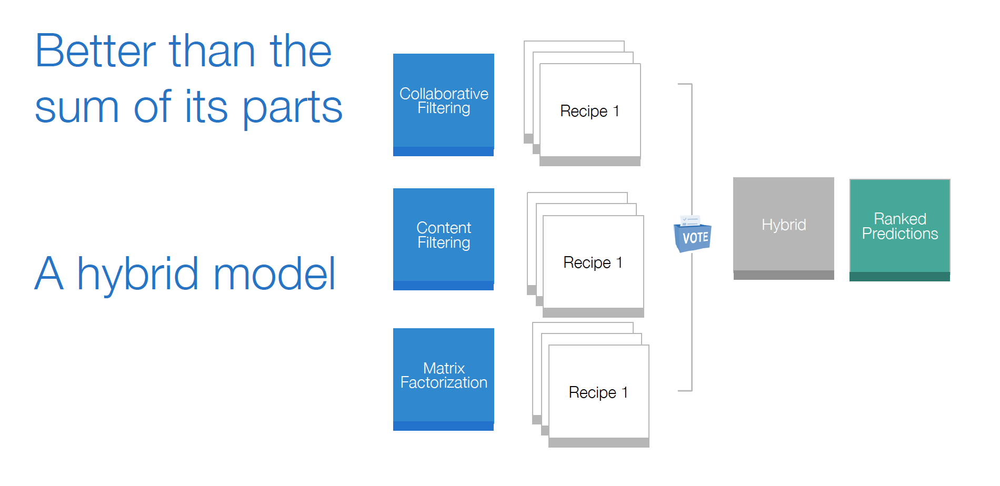
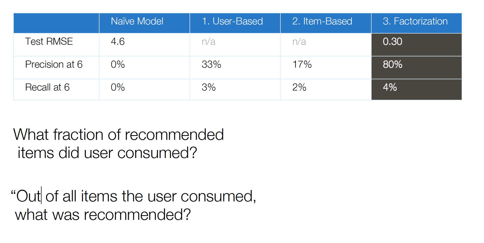
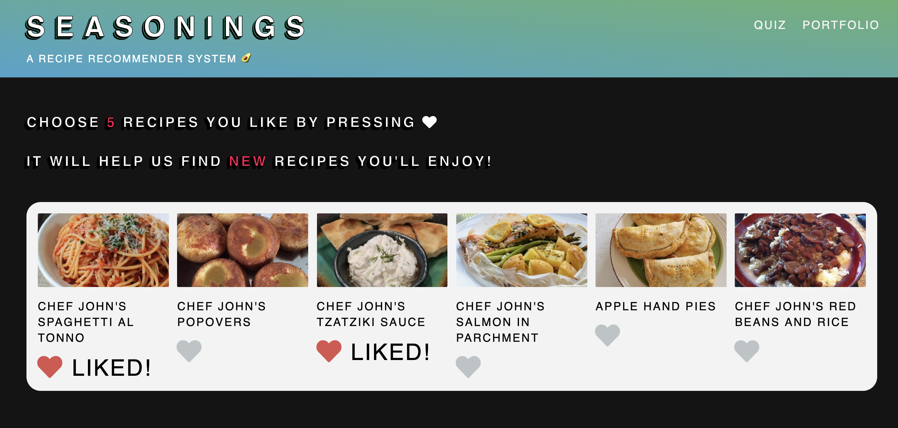
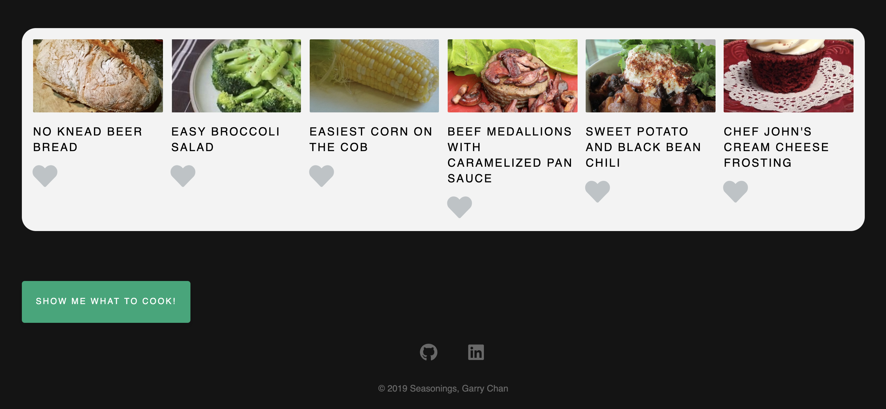
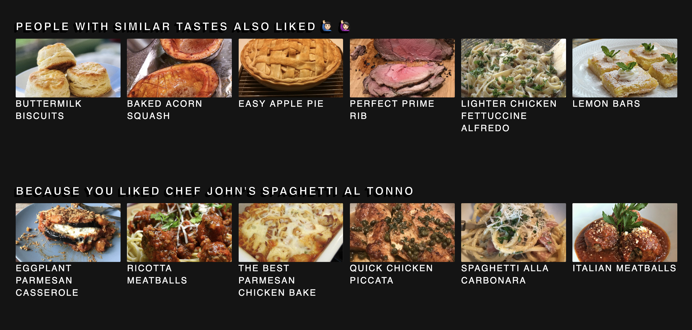
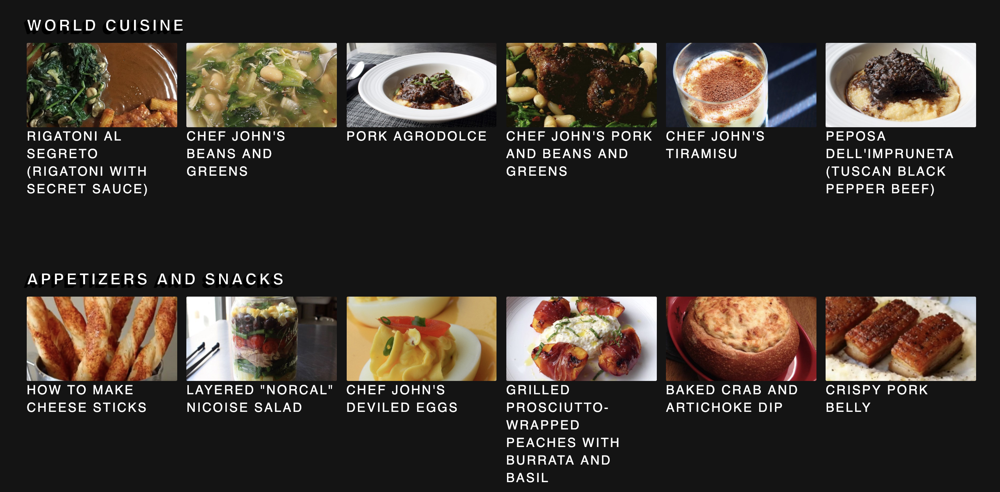
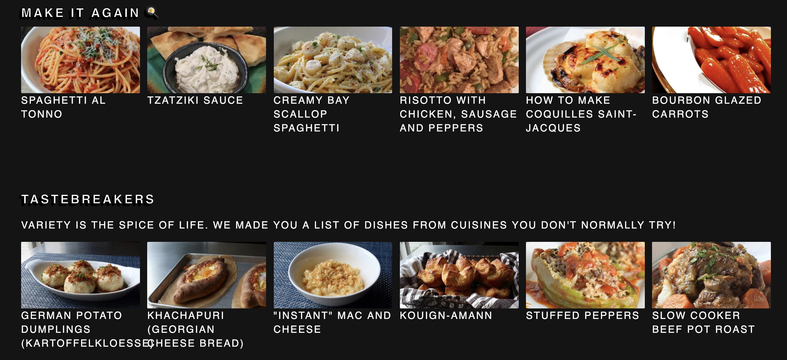

# Recipe Recommender System
Driven by my curiousity of how Netflix, Youtube and Spotify serve personalized recommendations, I decided to learn how to create my own recommender system.


**Machine Learning Problem**: Given a person’s preferences in past recipes, could I predict other new recipes they might enjoy?


I created Seasonings, a Recipe Recommender System. The motivation behind this web app is to help users discover personalized and new recipes, and prepare for grocery runs! I received a lot early positive feedback and plan future improvements to the UX and model.


I had a lot of fun making this, and plan to use this whenever I need a jolt of inspiration in the kitchen!


# Data 

Data was scraped from allrecipes.com, as there was no public API. I narrowed the scope to focus on Chef John's recipes (from FoodWishes.com).

Content Data

- ```all_recipes.csv```

- 1100+ Recipes from 

- 460+ Cuisines & Categories

  

Content Data

- ```all_users.csv```
- 55K Users
- 73K Ratings


# Tech Stack

1. **Data Wrangling**: pandas, numpy

   

2. **Web Scraping**: beautifulsoup, requests, regex

- Please refer to ```web_scraper.py``` for more details


2. **Model:** scikit-learn, scipy

- See ```requirements.txt``` for more


3. **Web Framework**: flask

- Run ```app.py``` on [localhost:5000](localhost:5000/) ```


4. **Front End**: html & css


# Models

Please refer to ```model.py``` 

1. Collaborative Filtering - Suggest recipes that other users similar to you also liked (Cosine Similarity)

> If I liked *Spaghetti Al Tonno*, and another user similar to me liked *Perfect Prime Rib* and I haven't tried it, the model would recommend that recipe.


2. Content Based Filtering - Suggest recipes that are similar to recipes that you like (Cosine Similiarity)

> If I liked Spaghetti Al Tonno, the model would recommend *Italian Meatballs*, because Italian Meatballs are similar to Spaghetti, in terms of the categories both recipes share (Italian, World Cuisine).


3. Matrix Factorization - Suggest recipes that you like, uncover latent factors, in a lower dimensional space (Singular Value Decomposition)

> If I liked *Turkey*, and I liked *Cranberry Sauce*, the model would recommend *Pumpkin Pie* because it picked up a latent factor that you liked Thanksgiving dishes, where the other models would not be able to.




# Model Evaluation



My final model was a hybrid recommender that tackled the cold-start problem with a content recommender, augmented with user preferences, and factorization to rank recipes based on a voting classifier rule.


# Screenshots

#### Onboarding





#### Results (Hybrid, Collaborative Filtering & Content Filtering)








# References

Special thanks to Kim Falk's book and also Maciej's GitHub for reference during this journey.

1. https://www.manning.com/books/practical-recommender-systems

2. https://github.com/lyst/lightfm

3. https://github.com/maciejkula/spotlight